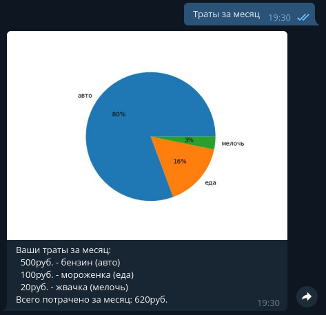
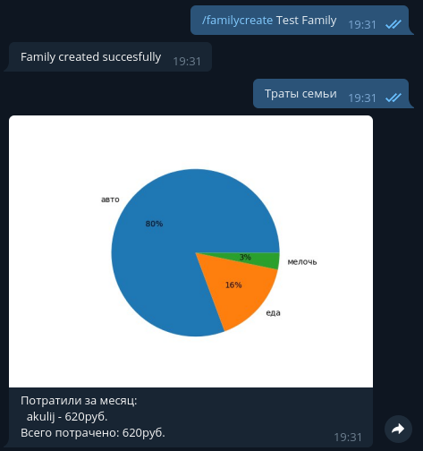

# SpendBot
###### Language: Python  
###### Libraries: aiogram, pandas, sqlalchemy, matplotlib
## Features:
### 1.Adding costs

### 2. Graphical costs view by category

### 3. Family costs support

## Setup
If you need to setup bot in virtual enviroment, enter in your shell:
```bash
make venv
source bin/activate
```

Then enter:
```
make setup
```
to setup the bot.

You need to enter corect values in fields.  
Some fields have default values. To keep them just hit Enter.

## Start
To start bot just enter:
```
make
```

